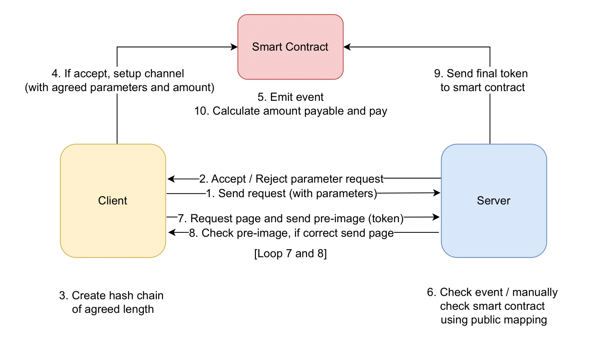
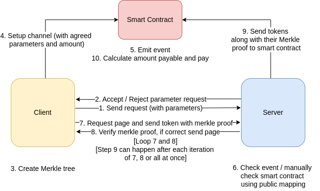

# μP2P

## Process Flow Diagrams
The process flow of interactions between the client, server, and smart contract is described in the following diagrams:

### Hash Chain-Based Scheme

### Merkle Tree-Based Scheme

